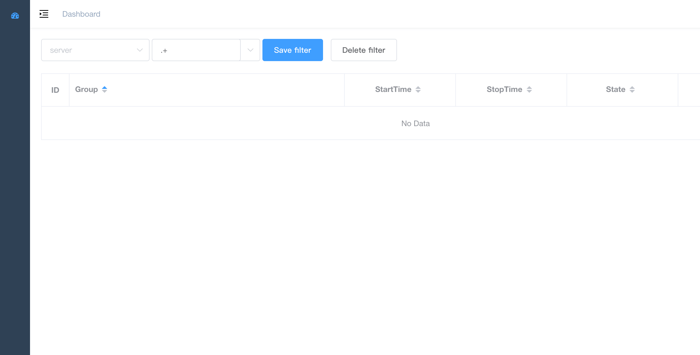

# supervisor-backtend
本项目可以和
[supervisor-frontend](https://github.com/lizongying/supervisor-frontend)
结合使用

## dev 
```
export GIN_MODE=debug 
go run supervisor.go -c ./conf/dev.yml
```

## prod
```
go build
export GIN_MODE=release
./supervisor -c ./conf/example.yml
```


